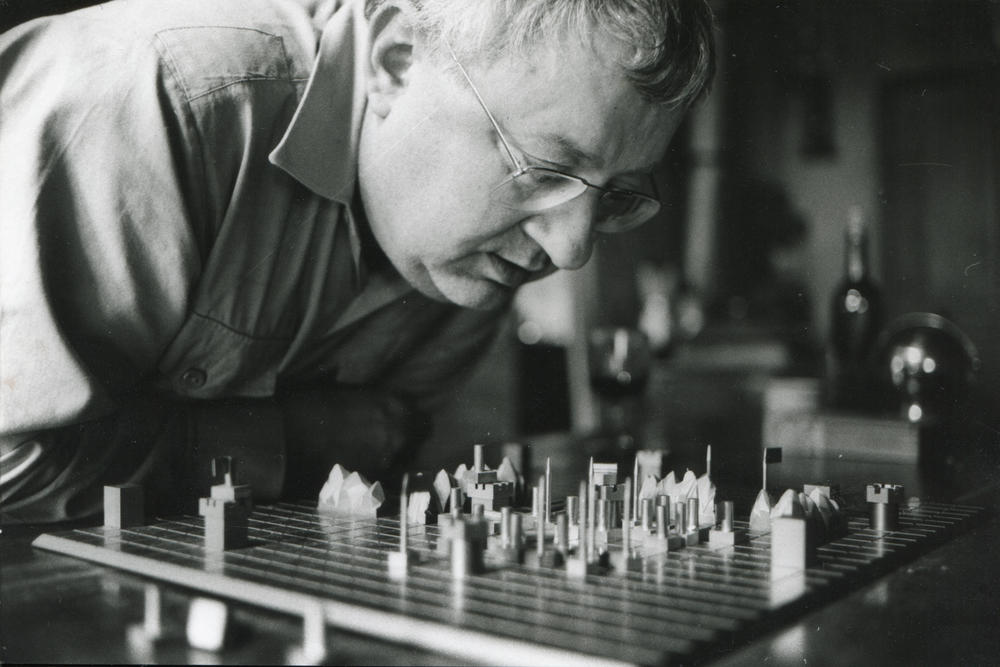

# Can an algorithm learn how to carry a revolution?
*An implementation of the war game defined by Guy Debord in Python and the training of a RL algorithm able to play it.*

||
| --- |
|Fonds Guy Debord, département des manuscrits, Bibliothèque nationale de France. Photographie de Jeanne Cornet.|

>"*J’ai donc étudié la logique de la guerre. J’ai d’ailleurs réussi, il y a déjà longtemps, à faire apparaître l’essentiel de ses mouvements sur un échiquier assez simple : les forces qui s’affrontent, et les nécessités contradictoires qui s’imposent aux opérations de chacun des deux partis. J’ai joué à ce jeu et, dans la conduite souvent difficile de ma vie, j’en ai utilisé quelques enseignements – pour cette vie, j’avais aussi fixé moi-même une règle du jeu ; et je l’ai suivie. Les surprises de ce Kriegspiel paraissent inépuisables ; et c’est peut-être la seule de mes œuvres, je le crains, à laquelle on osera reconnaître quelque valeur. Sur la question de savoir si j’ai fait bon usage de tels enseignements, je laisserai d’autres conclure.*" - Guy Debord, Panégyrique, 1989.

Ce projet a pour but d'implémenter le jeu de la guerre defini par Guy Debord et d'entrainer un algorithme de Reinforcement Learning capable d'y jouer.

Bibliographie: 

- Emmanuel Guy, *Le jeu de la guerre de Guy Debord - l'émancipation comme projet*, 
- Guy Debord, Alice Becker-Ho, *Le Jeu de la guerre*, Éditions Gérard Lebovici, 1987